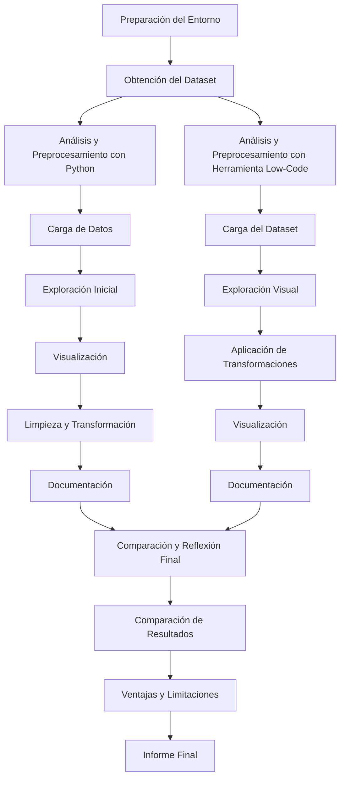

# T1. Exploración y preprocesado un dataset de consumo de agua

## **Objetivo del Ejercicio**

- **Objetivo:**  
  Explorar y preprocesar un dataset alternativo (por ejemplo, datos de consumo de agua) utilizando dos enfoques:  
  1. Código en Python (usando librerías como pandas, matplotlib y seaborn)  
  2. Una herramienta de IA low-code (por ejemplo, Dataprep o PyGWalker)  
  El objetivo es identificar patrones, limpiar y transformar los datos, y comparar las ventajas y limitaciones de cada enfoque.

---

## **Descripción del Ejercicio**

En este ejercicio, trabajarás con un dataset alternativo que representa el consumo de agua en una determinada área. Se te pedirá realizar las siguientes tareas:

1. **Exploración y Preprocesamiento con Código en Python:**  
   - Cargar y visualizar el dataset utilizando pandas.
   - Identificar y tratar datos faltantes, outliers y otros problemas de calidad.
   - Aplicar transformaciones (como normalización o escalado) y generar visualizaciones que ayuden a identificar patrones y tendencias.

2. **Exploración y Preprocesamiento con una Herramienta Low-Code:**  
   - Utilizar una herramienta low-code (por ejemplo, Dataprep o PyGWalker) para cargar el mismo dataset.
   - Explorar la interfaz para realizar las transformaciones y visualizaciones necesarias.
   - Comparar la experiencia y el resultado obtenido con la herramienta low-code respecto al código manual.

3. **Reflexión y Comparación:**  
   - Documentar las ventajas, limitaciones y diferencias entre ambos enfoques en términos de facilidad de uso, flexibilidad, tiempo de implementación y resultados obtenidos.
   - Reflexionar sobre en qué situaciones uno u otro enfoque puede ser más adecuado.

---

## **Secuencia de Pasos a Realizar**

1. **Preparación del Entorno:**  
   - Asegúrate de tener instalado Python y las librerías necesarias (pandas, matplotlib, seaborn).  
   - Accede a la herramienta low-code que vayas a utilizar (por ejemplo PyGWalker).

2. **Obtención del Dataset:**  
   - Descarga o accede a un dataset de consumo de agua. 
   - Puedes buscar un dataset público o utilizar un dataset simulado que contenga columnas como fecha, consumo (en litros o metros cúbicos), ubicación, etc.
   - Hay uno disponible en data/m4_t1_water_consumption_and_cost.csv.

3. **Análisis y Preprocesamiento con Python:**
   - **Carga de Datos:**  
     - Carga el dataset en un DataFrame de pandas.
   - **Exploración Inicial:**  
     - Usa `df.head()`, `df.describe()` y `df.info()` para obtener una visión general de los datos.
   - **Visualización:**  
     - Realiza gráficos de línea para ver la evolución del consumo, histogramas para ver la distribución y boxplots para identificar outliers.
   - **Limpieza y Transformación:**  
     - Identifica y trata valores faltantes (por ejemplo, mediante interpolación).
     - Realiza la normalización o escalado de los datos si es necesario.
   - **Documentación:**  
     - Toma nota de las transformaciones realizadas y de las observaciones encontradas en el análisis.
     - Entregable: Notebook ipynb con código y comentarios.

4. **Análisis y Preprocesamiento con Herramientaz Low-Code: PyGWalker**
   - **Carga del Dataset:**  
     - Usa el mismo dataset a la herramienta low-code.
   - **Exploración Visual:**  
     - Utiliza las funcionalidades de la herramienta para visualizar los datos y detectar problemas similares a los observados con Python. Quizás en este punto puede ser interesante usar Ydata Profiling.
   - **Visualización:**  
     - Genera gráficos interactivos y observa si la herramienta permite identificar patrones de manera intuitiva. Usa aquí PyGWalker.
   - **Documentación:**  
     - Anota cómo se realizan las transformaciones, la facilidad de uso y los resultados obtenidos.
     - Entregable: Notebook ipynb con código y comentarios.

5. **Comparación y Reflexión Final:**
   - **Comparación de Resultados:**  
     - Compara las visualizaciones, la rapidez de implementación y la claridad de los resultados entre ambos enfoques.
   - **Ventajas y Limitaciones:**  
     - Reflexiona sobre las ventajas de usar código (flexibilidad, personalización) frente a la facilidad y rapidez de las herramientas low-code.
   - **Informe Final:**  
     - Elabora un breve informe (1-2 páginas) donde resumas los pasos realizados, los resultados obtenidos y tus conclusiones sobre cuándo es más conveniente utilizar cada enfoque.
