## 🧩 Ejercicio 1: Buenas prácticas con prompts

---

### 🎯 Objetivo

Que el alumnado comprenda cómo el diseño de un prompt influye directamente en la calidad de la respuesta del modelo, y cómo aplicarlo en tareas básicas de análisis de datos como:
- Obtener una descripción general de un dataset.
- Listar las columnas y tipos de datos.
- Detectar valores nulos o incompletos.

---

### 🧠 Introducción: Usar LLMs como asistentes de análisis

Los modelos de lenguaje como [ChatGPT](https://chat.openai.com) o [Gemini](https://gemini.google.com/) pueden funcionar como asistentes para el análisis de datos. Les podemos preguntar cosas como:

- ¿Qué significa esta columna?
- ¿Cómo puedo limpiar los datos?
- ¿Puedes generar un gráfico con estos datos?

Sin embargo, **la calidad de las respuestas depende mucho de cómo formulamos la pregunta**, lo que se conoce como **prompt engineering**.

---

### 🆚 Comparativa: Buen prompt vs. mal prompt

Veamos algunos ejemplos genéricos:

| Prompt | ¿Qué hace bien o mal? |
|--------|------------------------|
| ❌ "Analiza este archivo." | Demasiado vago. No indica qué se espera del modelo. |
| ✅ "Este archivo contiene el consumo energético diario de un centro educativo. ¿Puedes decirme qué columnas tiene, qué tipo de datos hay y si hay valores nulos?" | Especifica el contexto, el tipo de datos y qué análisis se quiere. |
| ❌ "Hazme una gráfica." | No se indica qué variable usar, ni el tipo de gráfica deseada. |
| ✅ "Crea un gráfico de líneas que muestre cómo varía el consumo energético a lo largo del tiempo usando la columna 'fecha' y 'consumo'." | Preciso y orientado a una tarea clara. |

---

### 📁 Datos para el ejercicio

Usaremos un archivo CSV sencillo llamado `consumo_diario.csv`, con este contenido de ejemplo:

```
Fecha,Consumo,Temperatura,Humedad
2024-07-01,191.15,21.71,76.765
2024-07-02,185.83,21.969,73.388
2024-07-03,200.53,22.129,73.098
2024-07-04,197.76,22.161,75.965
2024-07-05,,,
2024-07-06,146.61,21.888,79.091
2024-07-07,,21.828,77.684
2024-07-08,188.83,21.505,75.153
2024-07-09,210.02,22.882,74.223
2024-07-10,217.54,23.288,77.848
2024-07-11,205.98,22.978,
2024-07-12,227.54,23.546,77.395
2024-07-13,191.4,,77.827
2024-07-14,147.53,22.055,82.324
2024-07-15,230.39,23.664,72.673
```

---

### ✍️ Paso a paso: Cómo formular un buen prompt para analizar un CSV

#### 🔹 Paso 1: Subir el archivo

Abre [ChatGPT](https://chat.openai.com/) o [Gemini](https://gemini.google.com/), y sube el archivo `consumo_diario.csv` o copia los datos tras el prompt.

---

#### 🔹 Paso 2: Probar con prompt básico (solo para comparar)

**Prompt:**  
```plaintext
Analiza estos datos.
```

**Respuesta del modelo:**  
> "Parece que tienes un conjunto de datos que contiene mediciones diarias de consumo (probablemente energético), temperatura y humedad. Vamos a analizar y tratar estos datos considerando las entradas faltantes y las relaciones entre las variables..."

A partir de aquí nos devuelve un análisis estadistico con le siguiente:

> Estadísticas Descriptivas:
> 
> Consumo: 
> Media: 195.47
> Desviación estándar: 23.82
> Mínimo: 146.61
> Máximo: 230.39
> 
> Temperatura:
> Media: 22.43°C
> Desviación estándar: 0.68°C
> Mínimo: 21.51°C
> Máximo: 23.66°C
> 
> Humedad:
> Media: 76.42%
> Desviación estándar: 2.53%
> ...


**Análisis:**  
- El modelo no sabe bien qué se espera.
- Puede asumir mal el contexto o quedarse esperando instrucciones.
- Realizará de manera un análisis estadístico no orientada a un resultado.

---

#### 🔹 Paso 3: Formular un prompt efectivo

**Prompt recomendado:**  
```plaintext
Analiza los siguientes datos que contienen el consumo energético diario de un centro educativo.  
Incluye un análisis detallado y conclusiones a partir respondiendo a los siguientes puntos:
1. Qué columnas tiene y qué tipo de datos contienen.
2. Si hay algún valor faltante o nulo.
3. Cuántos días de datos hay en total
4. Correlación entre variables.  
```

**Respuesta generada por el modelo**

> Para analizar los datos del consumo energético diario de un centro educativo, vamos a revisar cada punto que mencionaste:
> 
> 1. Columnas y Tipo de Datos
> Las columnas presentes en los datos son:
> Fecha: Contiene fechas en formato de año-mes-día. (Tipo de datos: fecha)
> Consumo: Representa el consumo energético diario medido probablemente en alguna unidad de energía como kWh. (Tipo de datos: numérico, flotante)
> Temperatura: Temperatura ambiente en grados Celsius en el centro educativo. (Tipo de datos: numérico, flotante)
> Humedad: Porcentaje de humedad en el ambiente. (Tipo de datos: numérico, flotante)
> 
> 2. Valores Faltantes o Nulos
> Hay varios valores faltantes en los datos. Por ejemplo:
> El 5 de julio falta toda la información excepto la fecha.
> El 7 de julio falta el dato de consumo.
> El 11 de julio falta el dato de humedad.
> El 13 de julio falta el dato de temperatura.
> 
> 3. Total de Días de Datos
> Los datos abarcan desde el 1 de julio de 2024 hasta el 15 de julio de 2024, lo que suma un total de 15 días.
> 
> 4. Correlación entre Variables
> Para entender la correlación entre el consumo, la temperatura y la humedad, calcularé el coeficiente de correlación de Pearson entre estas variables. Esto nos permitirá ver qué tan fuertemente relacionadas están entre sí estas variables

Además de completar el análisis nos da una serie de concullsiones realmente interesantes:

> Conclusiones
> Los datos presentan varias características interesantes y algunos retos:
> 
> - El consumo energético parece estar fuertemente relacionado con la temperatura, lo que es razonable suponer dado que en días más calurosos, el uso de acondicionadores de aire y otros sistemas de enfriamiento puede incrementarse.
> - La humedad tiene una correlación negativa con el consumo, lo cual es un hallazgo interesante que podría explorarse más para entender cómo afecta la eficiencia de los sistemas de climatización....

El resultado obtenido dando algo de **contexto** y siendo **más concretos** en coómo queremos que nos ayude (prompt), mejora con mucho la respuesta anterior.

### Cómo estructurar un prompt

```mermaid
graph TD
    A[Instrucción Clara] --> B(Contexto *);
    B --> C(Formato *);
    C --> D(Restricciones *);
    D --> E[Resultado GPT];

```

Desglose:

 - Instrucción Clara: El nodo principal que dirige la solicitud.
 - Contexto (Opcional): Información adicional para entender la solicitud.
 - Formato (Opcional): Especifica cómo debe ser la respuesta.
 - Restricciones (Opcional): Define límites o condiciones para la respuesta.
 - Resultado GPT: La salida generada por el modelo.

### 🧠 Discusión y análisis

Preguntas para el grupo:
- ¿La respuesta del modelo es coherente?
- ¿Se ha detectado correctamente el número de registros?
- ¿Qué diferencia marcó usar un prompt bien estructurado?

---

### ✅ Conclusiones del ejercicio

- Usar LLMs es sencillo, pero **el cómo preguntamos es clave**.
- Prompts claros, con contexto y estructura, producen respuestas más útiles.
- Esta técnica permite explorar datos sin necesidad de programación previa.

---

### 🔗 Recursos complementarios

- [Prompt Engineering Guide - OpenAI](https://platform.openai.com/docs/guides/gpt-best-practices)
- [Prompt Engineering Whitepaper (Kaggle)](https://www.kaggle.com/whitepaper-prompt-engineering)
- [Effective Prompting for Educators](https://www.aiforeducation.io/ai-resources/effective-prompting-for-educators)
- [AI for Education Prompt Library](https://www.aiforeducation.io/prompt-library)