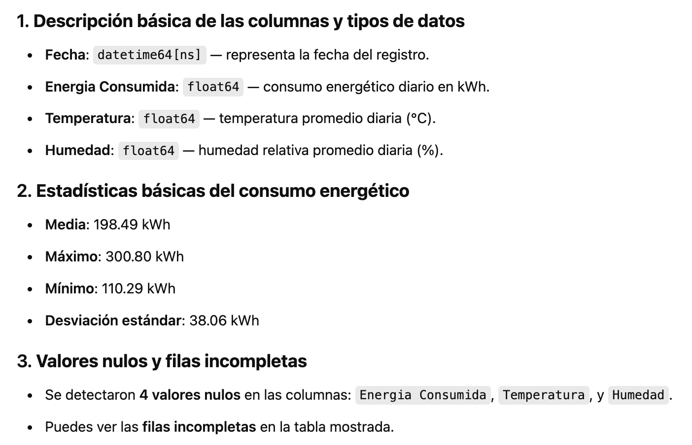
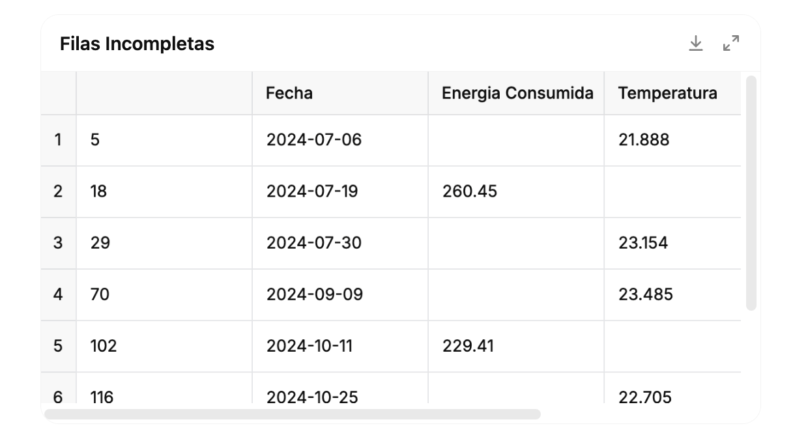
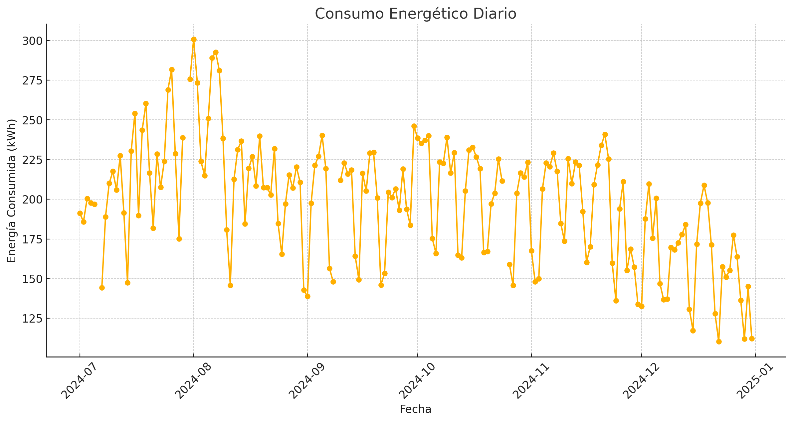
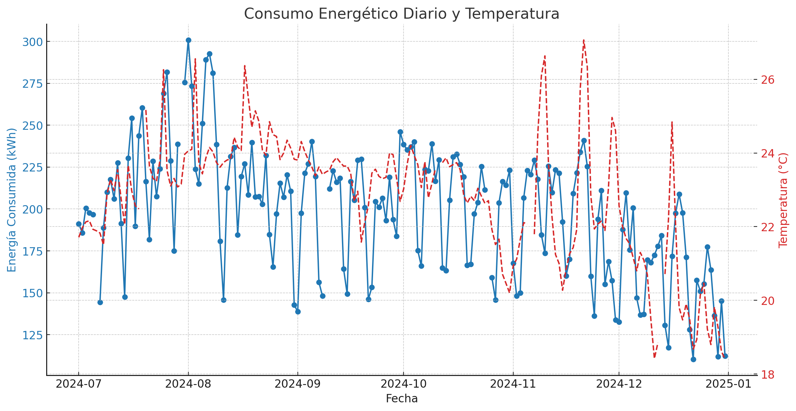
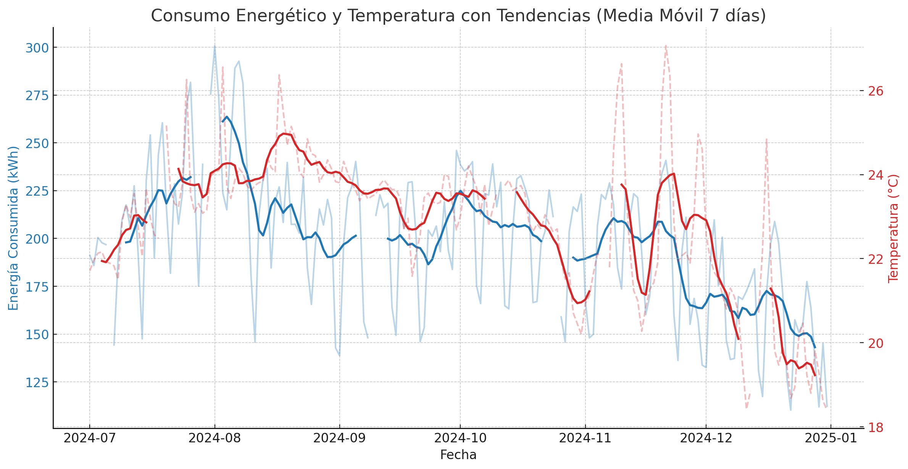

# Ejercicio 2: Análisis exploratorio automático con un modelo de lenguaje

## Objetivo

Usar un LLM para realizar un análisis exploratorio básico de un conjunto de datos subido por el usuario, utilizando **solo lenguaje natural**, sin necesidad de escribir código.

---

## Carga del dataset

Para el análisis usaremos registros de consumo energético diario de un centro educativo. Para ello subimos el archivo que se encuentra en:

```
data/m6_consumo_energia.csv
```

---

## Análisis descriptivo

Una vez subido el archivo al modelo (por ejemplo, en [ChatGPT con Code Interpreter](https://chat.openai.com) o [Gemini](https://gemini.google.com/)), se sugiere utilizar el siguiente prompt:

```plaintext
Este archivo contiene los registros de consumo energético diario (en kWh) de un centro educativo.  
¿Puedes hacer un análisis exploratorio con los siguientes puntos?

1. Descripción básica de las columnas y tipos de datos.
2. Estadísticas básicas: media, máximo, mínimo, desviación estándar del consumo.
3. Detección de valores nulos y filas incompletas.
```





Además de esto fantástico análisis, nos sugiere:
> ¿Quieres que limpie esos datos (por ejemplo, eliminar o imputar las filas incompletas)? También puedo hacer gráficos si te interesa ver tendencias o correlaciones

### Visualización de series temporales

Continuamos en el mismmo chat y preguntamos:

```plaintext
4. Gráfico de líneas que muestre el consumo diario.
```
> Aquí tienes el gráfico de líneas que muestra el consumo energético diario.



```plaintext
5. Gráfico de líneas que muestre el consumo diario y la temperatura ajustando la escala.
```
> Ahí tienes el gráfico combinado: el consumo energético en azul y la temperatura en rojo, con escalas ajustadas en ambos ejes.



```plaintext
6. Gráfico de líneas que muestre el consumo diario y la temperatura y sus tendencias. Ajusta la escala.
```
> Aquí tienes el gráfico con las líneas de consumo energético y temperatura, junto con sus tendencias suavizadas con una media móvil de 7 días. La opacidad diferencia los datos diarios de las líneas de tendencia más suaves.



### Correlaciones entre variables
```plaintext
7. Gráfico de correlacines entre todas las variables
```
> Ahí tienes la matriz de correlaciones entre consumo energético, temperatura y humedad. Los valores indican la fuerza y dirección de la relación entre variables:
> - Valores cercanos a 1 o -1 indican correlación fuerte (positiva o negativa).
> - Valores cercanos a 0 indican poca o ninguna correlación.


### Histogramas y cajas
```plaintext
8. Histograma de cada variable en un mismo gráfico
```
> Aquí tienes los histogramas de cada variable: consumo energético, temperatura y humedad. Te dan una idea clara de cómo se distribuyen los valores y si hay sesgos o concentraciones en ciertos rangos.


```plaintext
9. Gráfico de cajas en 3 figuras diferentes
```

> Aquí tienes los gráficos de caja para cada variable. Estos gráficos son útiles para detectar:
> - Distribución general de los datos.
> - Mediana y cuartiles.
> - Posibles valores atípicos (outliers), que aparecen como puntos fuera de los "bigotes".


### Filtrado de datos
```plaintext
10. Gráfico de lineas de temperatura y consumo para el mes de diciembre
```

> Aquí tienes el gráfico de líneas mostrando el consumo energético y la temperatura durante el mes de diciembre. Puedes observar cómo varían ambos factores día a día en ese periodo.


### Informe de análisis y conclusiones

```plaintext
Genera un informe de conclusiones sobre estos datos, teniendo en cuenta el análisis previo. Se conciso y usa un lenguaje cercano, sin entrar en tecnicismos.
```

> ¡Claro! Aquí tienes un informe con un tono más cercano y directo, ideal para compartir con personas no técnicas:
> 
> ### 🔍 ¿Qué se analizó?
> Se revisaron los registros diarios de energía consumida, junto con la temperatura y humedad ambiente. El objetivo fue entender mejor los patrones de consumo y cómo se relacionan con el clima.
> ### 📈 ¿Qué muestran los datos?
> - El consumo diario promedio fue de **casi 200 kWh**, con días de mayor gasto superando los **300 kWh**.
> - La **temperatura media** rondó los **22°C**, mientras que la humedad se movió entre el **70% y 80%**.
> - Algunos días tuvieron **valores extraños o faltantes**, pero fueron pocos (solo 4 casos).
> ### 📊 ¿Qué tendencias se notaron?
> - El consumo de energía **varía bastante día a día**, pero tiende a subir ligeramente en días más fríos.
> - La temperatura se mantuvo bastante estable en general, salvo algunas excepciones.
> - En diciembre, no se vio una tendencia clara en el consumo, aunque el clima fue algo más constante.
> ### 🔗 ¿Hay relación entre clima y consumo?
> - Hay una **ligera relación entre temperatura y consumo**: cuando hace más calor, el centro consume un poco más de energía (posiblemente por uso de aire acondicionado).
> - La **humedad no parece influir mucho** en el consumo eléctrico.
> ### 📌 ¿Qué se recomienda?
> - Revisar los días con consumo inusualmente alto, podrían indicar algún problema o uso especial.
> - Considerar otras variables, como el calendario escolar o eventos, para entender mejor los picos de consumo.
> - Mantener el monitoreo mensual para detectar cambios a tiempo y mejorar la eficiencia energética.

### Siguientes pasos

 - Formular preguntas como:
  - ¿Existe correlación entre consumo de energía y temperatura?
  - ¿Qué gráfica es la mejor para visualizar estas relaciones?
  - ¿Qué días se detecta un consumo inusualmente alto de energía?
  - ¿Muéstrame días inusualmente calurosos?
 - Complementar el análisis exploratorio (EDA) con gráficas de series temporales y distribución mes a mes 