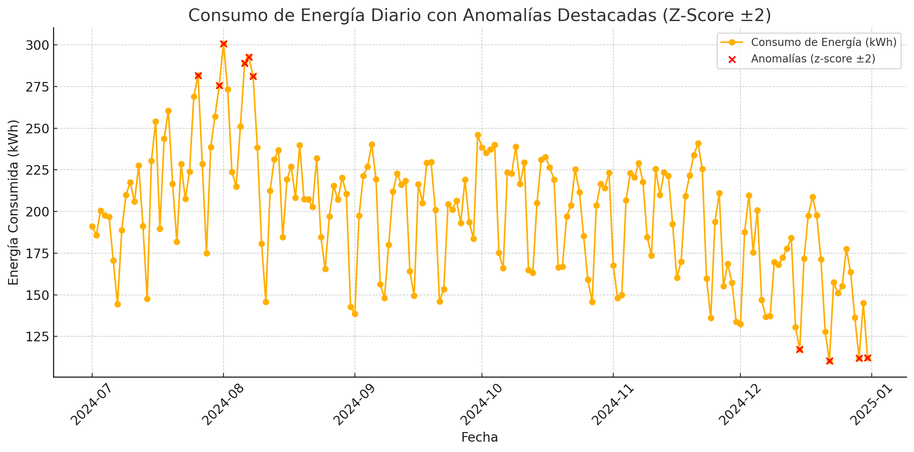

# Ejercicio 4: Detección de anomalías en series temporales usando LLMs

---

## 🎯 Objetivo

Utilizar un modelo de lenguaje (ChatGPT, Gemini) para detectar **anomalías** en una serie temporal de consumo energético, identificando días con valores inusuales mediante instrucciones en lenguaje natural.  
El alumnado aprenderá a interpretar gráficas generadas, formular hipótesis y validar resultados usando código generado por el modelo.

---

## 📁 Dataset utilizado

Ejemplo de contenido:

```
fecha,consumo_kWh
2023-01-01,34.5
2023-01-02,30.2
2023-01-03,33.8
2023-01-04,120.0   Anomalía
2023-01-05,29.9
2023-01-06,NaN
2023-01-07,32.1
2023-01-08,28.3
2023-01-09,90.0    Anomalía
2023-01-10,30.0
```
---

## ¿Qué es una anomalía?

Una **anomalía** es un valor que **se desvía mucho del comportamiento normal esperado**. En este contexto, puede indicar:
- Lecturas erróneas del medidor.
- Consumos inesperados por averías o eventos especiales.
- Problemas de captura o ingreso de datos.

---

## Descripción del ejercicio

---

### Paso 1: Subir el archivo al LLM

Abre [ChatGPT con Code Interpreter](https://chat.openai.com/) o [Gemini](https://gemini.google.com/), y copia y pega el contenido

---

### 🔹 Paso 2: Prompt inicial para detectar anomalías

```plaintext
Este archivo contiene el consumo energético diario de un centro educativo.

1. ¿Puedes detectar si hay valores inusuales o posibles errores?
2. ¿Qué días se desvían significativamente del consumo medio?
3. ¿Puedes generar un gráfico con los puntos anómalos destacados en rojo?

Si necesitas asumir algo, indícalo.
```

---

### 🔍 Paso 3: Interpretar la respuesta del modelo

> Listo, ya cargamos y ordenamos los datos. A simple vista, se pueden notar un par de valores que podrían ser anómalos:
> - 120.0 kWh el 4 de enero.
> - 90.0 kWh el 9 de enero.
> - Además, hay un valor faltante (NaN) el 6 de enero.
> El gráfico muestra el consumo diario de energía, y los puntos en rojo indican las anomalías detectadas usando el método del rango intercuartílico (IQR). Como esperábamos, los días 4 y 9 de enero aparecen como fuera de lo común.


---

### 📉 Paso 4: Validar con código generado

El alumnado puede pedir:

```plaintext
Muéstrame el código en Python que has utilizado para detectar esas anomalías y generar el gráfico.
```

> Claro! Aquí te dejo el código completo en Python que utilicé para detectar las anomalías usando el método del rango intercuartílico (IQR) y generar el gráfico:

```python
import pandas as pd
import matplotlib.pyplot as plt

 Crear DataFrame desde los datos CSV
data = {
    "fecha": [
        "2023-01-01", "2023-01-02", "2023-01-03", "2023-01-04", "2023-01-05",
        "2023-01-06", "2023-01-07", "2023-01-08", "2023-01-09", "2023-01-10"
    ],
    "consumo_kWh": [34.5, 30.2, 33.8, 120.0, 29.9, None, 32.1, 28.3, 90.0, 30.0]
}

df = pd.DataFrame(data)
df["fecha"] = pd.to_datetime(df["fecha"])

 Rellenar valores faltantes (NaN) para el análisis (no imputación definitiva)
df_temp = df.copy()
df_temp["consumo_kWh"].fillna(method="ffill", inplace=True)

 Detección de anomalías usando el método IQR
Q1 = df_temp["consumo_kWh"].quantile(0.25)
Q3 = df_temp["consumo_kWh"].quantile(0.75)
IQR = Q3 - Q1

lower_bound = Q1 - 1.5 * IQR
upper_bound = Q3 + 1.5 * IQR

df_temp["anomaly"] = (df_temp["consumo_kWh"] < lower_bound) | (df_temp["consumo_kWh"] > upper_bound)

 Graficar
plt.figure(figsize=(10, 5))
plt.plot(df_temp["fecha"], df_temp["consumo_kWh"], label="Consumo (kWh)", marker="o")
plt.scatter(df_temp[df_temp["anomaly"]]["fecha"],
            df_temp[df_temp["anomaly"]]["consumo_kWh"],
            color="red", label="Anomalías", zorder=5)
plt.title("Consumo Diario con Anomalías Destacadas")
plt.xlabel("Fecha")
plt.ylabel("Consumo (kWh)")
plt.legend()
plt.grid(True)
plt.xticks(rotation=45)
plt.tight_layout()
plt.show()

```

## 🧠 Discusión posterior

**Preguntas para reflexionar:**
- ¿Qué criterio ha usado el modelo para definir una anomalía?
- ¿Se podría usar otro enfoque (por ejemplo, desviación intercuartílica, media móvil...)?
- ¿Qué impacto tendría no detectar esas anomalías?
- ¿Podría una anomalía ser un evento real y no un error?

---

## Variante del ejercicio

### Carga del sataset
Usar el conjunto de datos disponible en:

```
data/m6_consumo_energia.csv
```
 Ejecución de prompt
Y enviamos el mismo prompt
```plaintext
Este archivo contiene el consumo energético diario de un centro educativo.

1. ¿Puedes detectar si hay valores inusuales o posibles errores?
2. ¿Qué días se desvían significativamente del consumo medio?
3. ¿Puedes generar un gráfico con los puntos anómalos destacados en rojo?

Si necesitas asumir algo, indícalo.
```

> Ya cargué el dataset. Tiene 184 registros con las siguientes columnas:
> - Fecha
> - Energia Consumida (hay 4 valores faltantes)
> - Temperatura (también 4 valores faltantes)
> - Humedad (4 valores faltantes)
> 
> Vamos a enfocarnos ahora en:
> - Detectar valores inusuales o posibles errores en el consumo.
> - Identificar los días con desviaciones significativas del promedio.
> - Graficar los valores anómalos en rojo.
> Voy a comenzar limpiando los datos y aplicando un análisis de anomalías similar al que hicimos antes



### Genración de código

```
Dame el código en python para detectar anomalías con z-score y generar el gráfico anterior
```

> ¡Claro! Aquí tenés el código completo en Python para **detectar anomalías usando z-score con umbral ±2** y **generar el gráfico** donde se destacan en rojo los valores anómalos:

```python
import pandas as pd
import matplotlib.pyplot as plt
from scipy.stats import zscore

 Cargar el dataset
df = pd.read_csv("data/m6_consumo_energia.csv")
df['Fecha'] = pd.to_datetime(df['Fecha'])

 Interpolar valores faltantes en 'Energia Consumida'
df['Energia Consumida'] = df['Energia Consumida'].interpolate()

 Calcular z-score
df['z_score'] = zscore(df['Energia Consumida'])

 Detectar anomalías con umbral ±2
threshold = 2
df['Anomalia'] = abs(df['z_score']) > threshold

 Generar gráfico
plt.figure(figsize=(12, 6))
plt.plot(df['Fecha'], df['Energia Consumida'], label='Consumo de Energía (kWh)', marker='o')
plt.scatter(df[df['Anomalia']]['Fecha'],
            df[df['Anomalia']]['Energia Consumida'],
            color='red', label='Anomalías (z-score ±2)', zorder=5)
plt.title('Consumo de Energía Diario con Anomalías Destacadas (Z-Score ±2)')
plt.xlabel('Fecha')
plt.ylabel('Energía Consumida (kWh)')
plt.legend()
plt.grid(True)
plt.xticks(rotation=45)
plt.tight_layout()
plt.show()
```

---

## ✅ Conclusiones del ejercicio

- Los LLMs pueden detectar valores atípicos en datos temporales usando lenguaje natural.
- Es posible validar el análisis mediante código generado automáticamente.
- Esto permite al profesorado aplicar IA sin necesidad de conocimientos avanzados de estadística.

---

## 🔗 Recursos complementarios

- 📘 [Anomaly Detection in Time Series using ChatGPT](https://medium.com/@sztistvan/anomaly-detection-in-time-series-using-chatgpt-3fc48f958c88)
