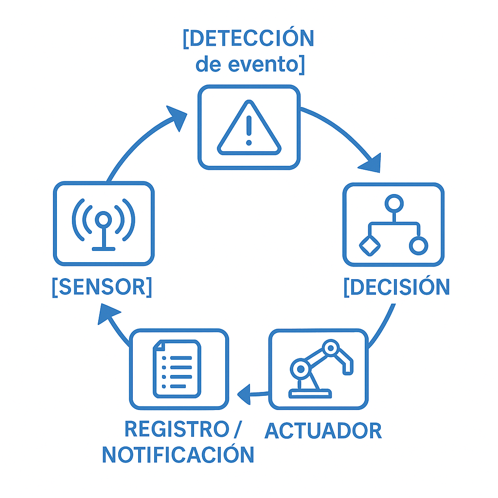
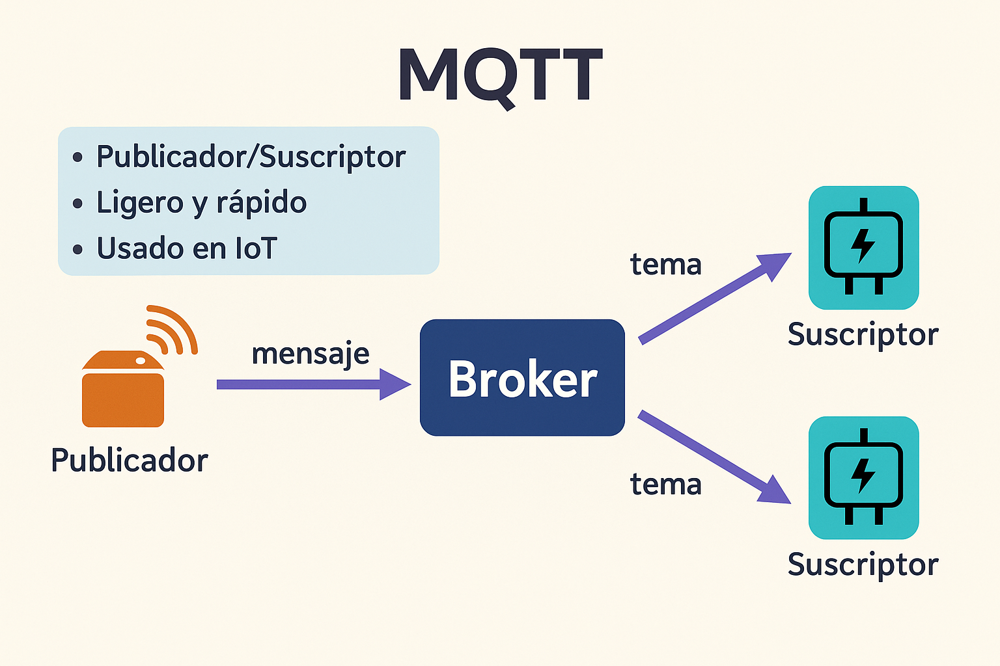

# **Introducción Teórica**

## **Objetivo de la introducción**

Entender cómo los sistemas inteligentes pueden **reaccionar automáticamente** a condiciones detectadas en los datos, integrando sensores, algoritmos y dispositivos en un ciclo continuo.

---

## **1. ¿Qué significa "automatizar una respuesta"?**

Imaginemos que estamos en un invernadero con sensores que miden humedad del suelo. Podemos:

* **Revisar los datos cada mañana** y decidir si regar (modo manual).
* **Configurar un umbral**: si la humedad baja de cierto nivel, encendemos el riego (modo automático).
* **Detectar patrones anómalos**, como un sensor que se dispara por una fuga (modo inteligente).

**Idea clave**: *Una automatización es una reacción predefinida a un evento. Lo inteligente está en cómo detectamos ese evento.*

---

## **2. Ciclo de una automatización inteligente**



Ejemplo concreto:

* Sensor detecta caudal de agua anormal.
* Se compara con el patrón esperado.
* Si se detecta una fuga: cierra válvula + envía alerta a móvil.

---

## **3. Protocolos de comunicación: el lenguaje de las máquinas**

Genial, aquí tienes una ampliación detallada y didáctica de la sección sobre **MQTT y Webhooks**, pensada para que el profesorado pueda entender su funcionamiento, diferencias y usos, con enlaces útiles y ejemplos educativos.

---

## Protocolos para la Automatización en IoT**

### **MQTT (Message Queuing Telemetry Transport)**

#### ¿Qué es?

MQTT es un protocolo de mensajería **ligero**, ideal para comunicaciones entre dispositivos en entornos de IoT, especialmente donde el ancho de banda, la energía o la latencia son limitados.

#### ¿Cómo funciona?

MQTT se basa en un modelo **publicador / suscriptor**:

* Un **cliente** (sensor o sistema) **publica** mensajes en un "tema" (`topic`), por ejemplo:
  `agua/caudal/edificioA`
* Otros clientes se **suscriben** a ese tema y reciben los mensajes automáticamente.
* Un **broker MQTT** centraliza la comunicación (ej: Mosquitto, HiveMQ, etc.).



#### Ejemplo:

* Sensor de caudal publica en `agua/consumo`.
* Un script en Python, una app o un sistema Node-RED se suscribe y actúa si detecta valores anómalos.

#### Herramientas recomendadas:

* **Broker local:** 
    
  * [Eclipse Mosquitto](https://mosquitto.org/)
  * 
* **Broker online (pruebas):**

  * [HiveMQ Public Broker](https://www.hivemq.com/public-mqtt-broker/)
  * [MQTT Dashboard](http://www.mqtt-dashboard.com/)
* **Clientes visuales:**

  * [MQTT Explorer (Windows/Mac/Linux)](http://mqtt-explorer.com/)
  * [MQTTBox (Chrome app)](https://workswithweb.com/mqttbox.html)

#### Recursos para aprender:

* Guía oficial Eclipse: [https://mqtt.org/documentation](https://mqtt.org/documentation)
* Curso interactivo gratuito: [HiveMQ MQTT Essentials](https://www.hivemq.com/mqtt-essentials/)

---

### **Webhooks**

#### ¿Qué es?

Un **webhook** es un mecanismo para permitir que una aplicación web proporcione información a otra **en tiempo real**, mediante una **petición HTTP**.

En lugar de “escuchar” permanentemente, el webhook **espera a que se le envíe algo**, reaccionando al instante.

#### Ejemplo educativo:

* Un script Python detecta un consumo excesivo de agua.
* Hace una petición HTTP a un webhook que activa un aviso en **IFTTT** o **Slack**, o incluso una orden para cerrar una válvula.

#### Herramientas recomendadas:

* **Zapier**: automatización entre apps → [https://zapier.com](https://zapier.com)
* **IFTTT**: muy visual, ideal para profesorado → [https://ifttt.com](https://ifttt.com)
* **Webhook.site**: herramienta para probar envíos → [https://webhook.site](https://webhook.site)

#### Recursos para aprender:

* Qué es un webhook: [https://zapier.com/blog/what-are-webhooks/](https://zapier.com/blog/what-are-webhooks/)
* Crear webhooks con IFTTT: [https://help.ifttt.com/hc/en-us/articles/360040112394](https://help.ifttt.com/hc/en-us/articles/360040112394)

---

### **MQTT vs Webhooks: ¿cuándo usar cada uno?**

| Característica     | MQTT                                    | Webhook                                |
| ------------------ | --------------------------------------- | -------------------------------------- |
| Modelo             | Publicador/Suscriptor                   | Petición HTTP puntual                  |
| Dirección de datos | Bidireccional                           | Unidireccional (cliente → servidor)    |
| Ideal para...      | Dispositivos IoT en red local           | Acciones puntuales o servicios web     |
| Requiere broker    | ✅ Sí                                    | ❌ No                                   |
| Facilidad de uso   | Media (requiere instalación o servicio) | Alta (muy intuitivo con Zapier, IFTTT) |
| Latencia           | Muy baja                                | Baja-moderada                          |

---

### Combinación de protocolos

💡 Una arquitectura efectiva puede usar ambos:

* MQTT para comunicación entre sensores y scripts locales (rápido, fiable).
* Webhooks para alertas, notificaciones o integración con plataformas educativas y de mantenimiento.

---

## **4. ¿Dónde entra la inteligencia artificial?**

La IA entra en la parte **intermedia del flujo**, al decidir si lo que estamos viendo **es normal o no**.

* Puede detectar:

  * Fugas
  * Comportamientos extraños en energía o temperatura
  * Actividad inesperada (ej. máquina encendida fuera de horario)

Un modelo de IA aprende de datos históricos y es capaz de decir: “esto no es normal”.

📌 *Ejemplo real*:
En un colegio, el sistema detecta un consumo de agua elevado un sábado a las 3 a.m. → Activa alarma → Cierra válvula principal.

---

## **5. Conectando todo: Automatización en red de agua (visión general del caso práctico)**

Introducir con una pequeña historia:

> “En un centro educativo, hay sensores de caudal de agua conectados a un sistema. Un día, uno de los sensores detecta un aumento inesperado de consumo fuera del horario habitual. El sistema, gracias a un modelo de detección de anomalías, identifica que podría haber una fuga. Inmediatamente, el sistema cierra una válvula motorizada y envía un mensaje al personal de mantenimiento.”

Mostrar cómo encajan:

* MQTT → comunicación rápida con sensores y actuadores.
* Webhook → activación de notificaciones externas.
* IA → toma de decisiones basada en datos históricos.

---

## **Cierre: Mapa mental del sistema**

Diagrama-resumen de lo que vamos a aprender a implementar:

```
[Sensor de caudal] --MQTT--> [Sistema IA] --Detecta anomalía--> [Webhook o MQTT] --> [Actuador] + [Notificación]
```