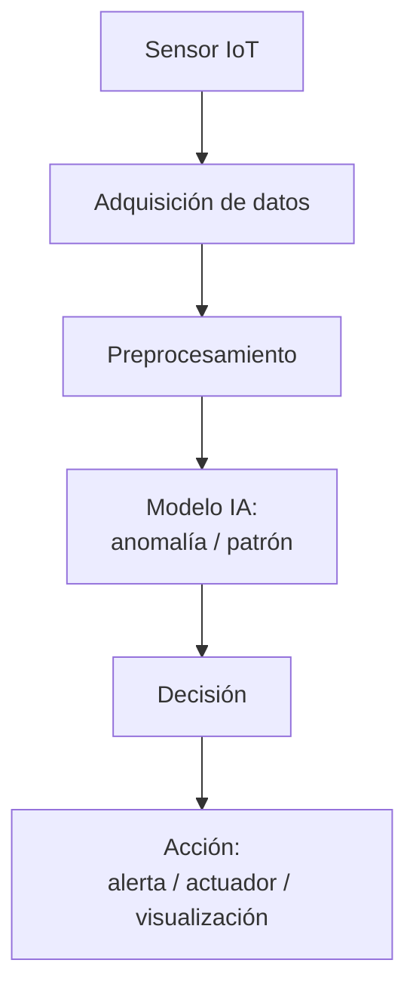

# **Pipelines en IoT para Automatización Inteligente**

## **Objetivo**

Mostrar cómo una red IoT puede no solo recoger datos y ejecutar acciones, sino también **tomar decisiones inteligentes** basadas en esos datos mediante técnicas simples de IA (detección de anomalías, umbrales dinámicos, etc.).

---

## ¿Qué es un pipeline de automatización inteligente?

Podemos entender un *pipeline* como una **cadena de procesamiento** de eventos que sigue esta secuencia lógica:

Cada bloque puede ser implementado con distintas tecnologías:

* Python (pandas, scikit-learn)
* Node-RED (nodos lógicos + funciones)
* Dashboards (para supervisión)

### Buena práctica
**"Dibuja tu pipeline":**

Representar visualmente cómo sería un pipeline de detección + automatización aplicado a su contexto: caudal, energía, CO₂, etc.

---

## ¿Dónde entra la Inteligencia Artificial?

En la etapa de **detección**, el sistema puede incorporar IA para:

* Detectar **anomalías** en el comportamiento de sensores (caudales muy altos, horarios inusuales...)
* Reconocer **patrones de uso** que se salgan de lo habitual
* Prever posibles fallos o consumos inesperados (predicción)

📌 Ejemplos simples:

* **Modelo basado en umbral estático**: si caudal > 15 → alerta
* **Modelo dinámico (media móvil)**: si valor > media + 2\*desviación → alerta
* **Isolation Forest o One-Class SVM**: entrenado con comportamiento normal → detecta lo que se sale de la norma

---

## Flujo de trabajo típico con IA + IoT

1. Sensor envía lectura cada 5 segundos por MQTT
2. Script o flujo en Node-RED la recoge
3. Se evalúa si el valor es normal o no (modelo IA en Python o lógica en Node-RED)
4. Si se detecta una anomalía → se publica un mensaje o se lanza un webhook

---

## Ejemplo aplicado: detección de fuga de agua

**Caso:** Un sensor de caudal sigue leyendo 10 L/min durante la madrugada

**Pipeline:**

* Ingesta → series temporales → modelo detecta que ese patrón es anómalo (porque normalmente es 0 L/min)
* Se activa una **respuesta automática**: cerrar válvula motorizada + enviar mensaje Telegram

---

## Sencillez ante todo: ¿qué IA podemos usar?

### A. Con programación:

* **Isolation Forest** (scikit-learn)
* **Reglas con pandas** (umbral dinámico)
* **Prophet** o **media móvil** para detectar desvíos

### B. Sin programación:

* **Node-RED + función `switch` y lógica condicional**
* **Plataformas como Ubidots, ThingsBoard o IFTTT con reglas definidas**

---

# 6. Recursos y herramientas recomendadas

* Librerías: `scikit-learn`, `pandas`, `joblib` para guardar modelos
* Visualización: `Plotly`, `Dash`, `Node-RED Dashboard`
* Simulación: sensores virtuales en Python o injects en Node-RED
