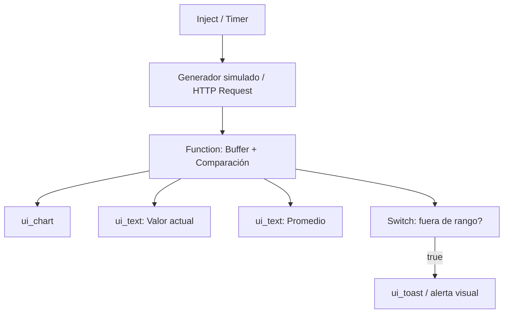

# Ejercicio 1 – Visualización en tiempo real con Node-RED Dashboard

## Objetivo del ejercicio

Diseñar un flujo en Node-RED que visualice en tiempo real los datos de un sensor (simulado o real vía API REST de ThingsBoard), permitiendo la supervisión visual de las variables y la generación de alertas basadas en umbrales configurables por el usuario.

### Flujo


---

## Resultados esperados

* Gráfico de línea en tiempo real en el dashboard.
* Visualización del valor actual con colores que indiquen normalidad o alarma.
* Ajuste dinámico del umbral de alerta desde el panel.
* Flexibilidad en la fuente de datos: simulada o desde API REST de ThingsBoard.

## 🛠️ Requisitos previos

Antes de comenzar, asegúrate de tener instaladas las siguientes librerías:

| Librería                                    | Comando de instalación                     | Uso                           |
| ------------------------------------------- | ------------------------------------------ | ----------------------------- |
| `node-red-dashboard`                        | `npm install node-red-dashboard`           | Visualización en el dashboard |
| `node-red-node-email` *(opcional)*          | `npm install node-red-node-email`          | Envío de alertas por correo   |
| `node-red-contrib-telegrambot` *(opcional)* | `npm install node-red-contrib-telegrambot` | Notificaciones Telegram       |

---

## 🔧 Opciones de entrada de datos

* **Simulación local** con `inject` y `function`.
* **Lectura desde API REST de ThingsBoard**, utilizando `http request` y un `function` para procesar la respuesta.

---

## 🔁 Lógica del flujo (resumen)

1. Obtener un valor cada 5 segundos.
2. Mantener una lista (buffer) con los últimos 20 valores.
3. Calcular el promedio del buffer.
4. Comparar el valor actual con ese promedio:

   * Si está fuera del rango ±25%, activar alerta.
5. Mostrar todo en el panel: valor, promedio, gráfico, y alerta.

---

## 🧱 Componentes del flujo

| Componente                               | Función                            |
| ---------------------------------------- | ---------------------------------- |
| `inject` o `http request`                | Generación o adquisición de datos  |
| `function` (buffer)                      | Acumula valores y calcula promedio |
| `switch`                                 | Detecta si se sale del rango       |
| `ui_chart`, `ui_text`, `ui_gauge`        | Visualización                      |
| `ui_toast` o `ui_text`                   | Alerta visual en el panel          |
| *(opcional)* `email` o `telegram sender` | Alerta externa                     |

---

### Paso 1: Adquisición de datos

#### Opción A – Simulación local

1. Añadir un nodo `inject` con repetición cada 5 segundos.
2. Conectar a un nodo `function` que genere un valor aleatorio con ruido:

   ```javascript
   msg.payload = {
       valor: Math.round(100 + Math.random() * 30)
   };
   return msg;
   ```
3. Enviar al `ui_chart` y `ui_text`.
4. Usar un nodo `switch` que compare `valor` con el umbral.
5. Mostrar mensaje de alerta si se supera.

#### Opción B – Consulta a ThingsBoard

1. Añadir un nodo `inject` para activar el flujo periódicamente.
2. Conectar a un nodo `http request` con la URL:

   ```
   https://<tb_url>/api/plugins/telemetry/DEVICE/<deviceId>/values/timeseries?keys=<key>
   ```

   * Añadir cabecera `Authorization: Bearer <token>`
3. Procesar la respuesta JSON en un nodo `function`.
4. Continuar igual que en opción A.

### Paso 2: Acumulación y detección

Nodo function llamado "Detección":

```javascript
// Inicializar buffer si no existe
let buffer = context.get('buffer') || [];

// Obtener valor actual
let valorActual = Number(msg.payload.valor);

// Añadir nuevo valor al buffer
buffer.push(valorActual);
if (buffer.length > 20) {
    buffer.shift();  // Mantener solo los últimos 20
}

// Calcular media
let suma = buffer.reduce((a, b) => a + b, 0);
let media = suma / buffer.length;

// Guardar buffer actualizado
context.set('buffer', buffer);

// Calcular límites
let margen = media * 0.25;
let limiteSuperior = media + margen;
let limiteInferior = media - margen;

// Evaluar si el valor está fuera de rango
msg.payload = {
    valor: valorActual,
    media: media.toFixed(2),
    fueraDeRango: (valorActual > limiteSuperior || valorActual < limiteInferior),
    buffer: buffer
};

return msg;
```

Este `msg.payload` se puede enviar a:

* Un `ui_chart` con los 20 valores (`buffer`)
* Un `ui_text` con el estado (`fueraDeRango`)
* Un nodo `switch` que active alertas según ese valor

### Visualización en el dashboard
1. Nodo ui_chart

  * Label: "Histórico (últimos 20)"
  * Grupo: Dashboard
  * Usar msg.payload.buffer como array de datos

2. Nodo ui_text o ui_gauge

  * Muestra msg.payload.valor
3. Nodo ui_text (adicional)

  * Muestra msg.payload.media
4. Nodo switch

  * Condición: msg.payload.fueraDeRango == true

### Paso 4: Notificación de evento
Al detectar un evento se dispara el eevento de notificación.

#### Opción A. Globo en pantalla
Si se cumple la condición anterior → nodo ui_toast. Fijar msg.topic a “⚠ Valor fuera del rango”

#### Opción B. Boy de Telegram

**Requisitos previos**

Antes debes instalar el paquete:

```bash
cd ~/.node-red
npm install node-red-contrib-telegrambot
```

**Configurar un bot de Telegram**

1. Abre Telegram y busca `@BotFather`.
2. Crea un nuevo bot: `/newbot`
3. Guarda el **token** que te entrega.
4. Usa `/start` en un chat con el bot desde tu cuenta.
5. Usa un nodo `telegram receiver` en Node-RED para capturar el `chatId` (aparecerá en `msg.chat.id`)
6. Configura el `telegram sender` con tu token y ese `chatId` (puedes dejarlo dinámico si lo pasas como `msg.chatId`).

**Uso del nodo**

Entradas esperadas:

  * msg.payload.type: "message"
  * msg.payload.content: Texto del mensaje a enviar.
  * msg.payload.chatid (opcional): Si no se define, usará el configurado por defecto.

Más información en: [https://flows.nodered.org/node/node-red-contrib-telegrambot]https://flows.nodered.org/node/node-red-contrib-telegrambot()